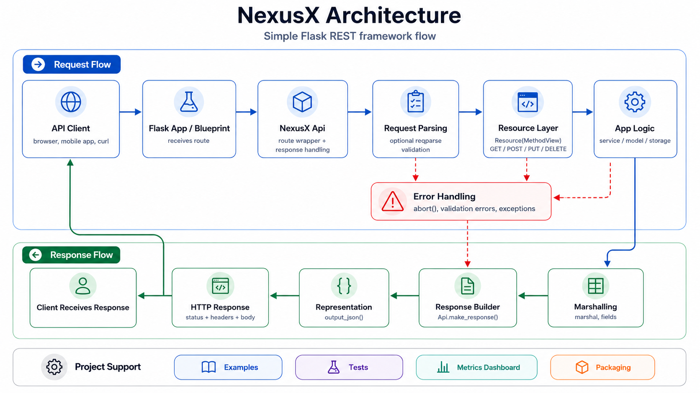
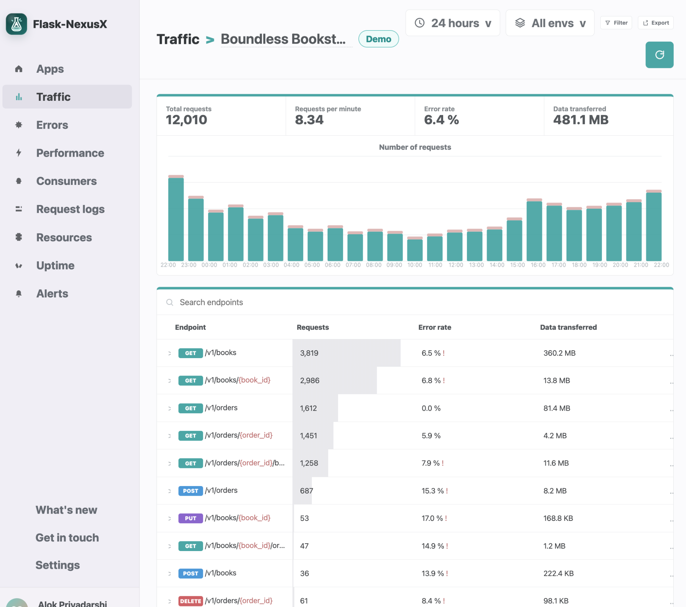
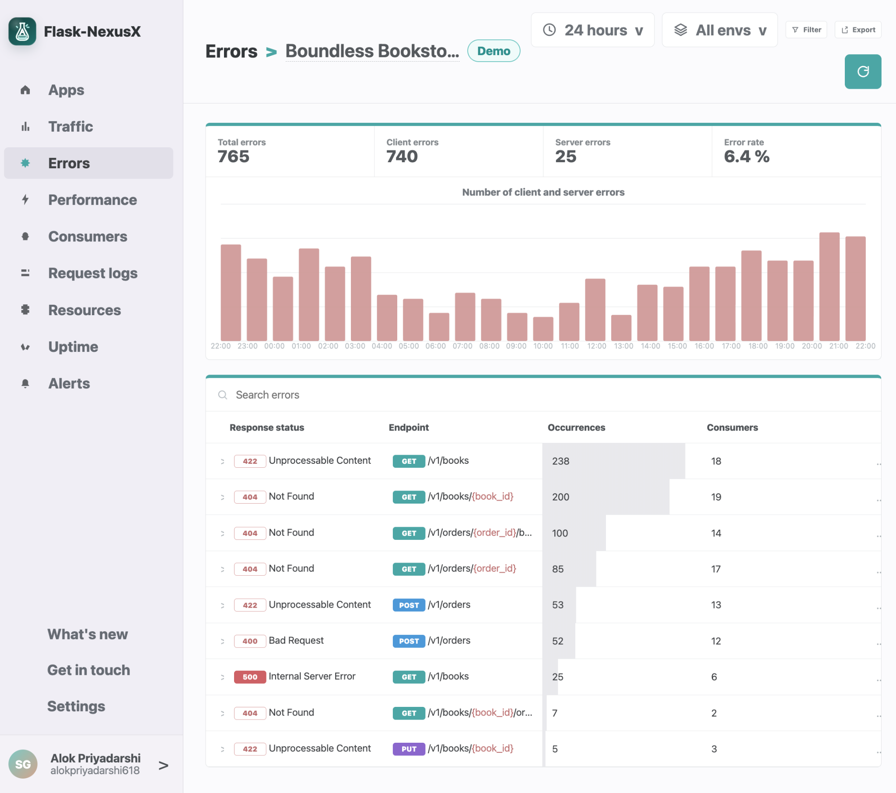
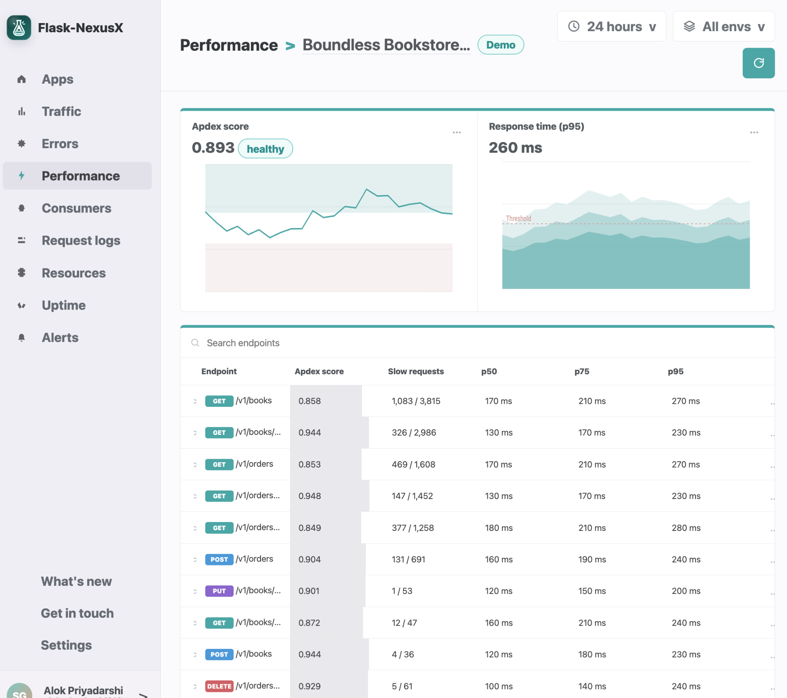
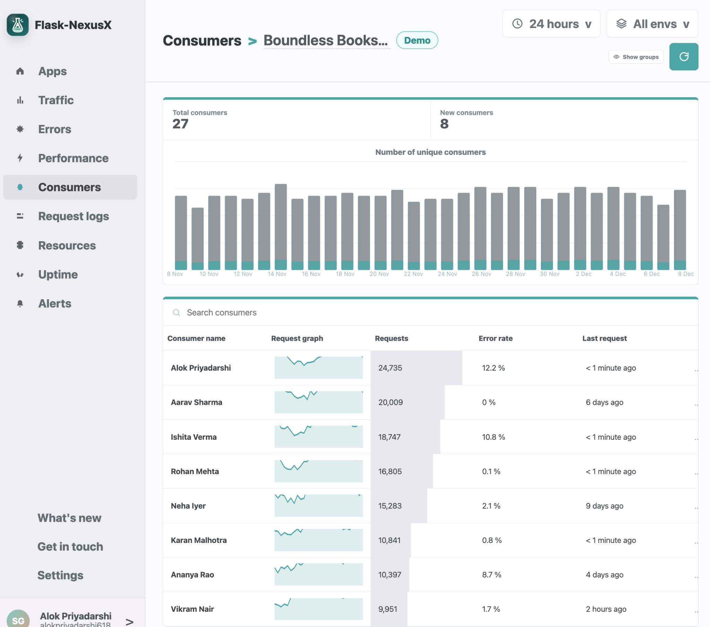
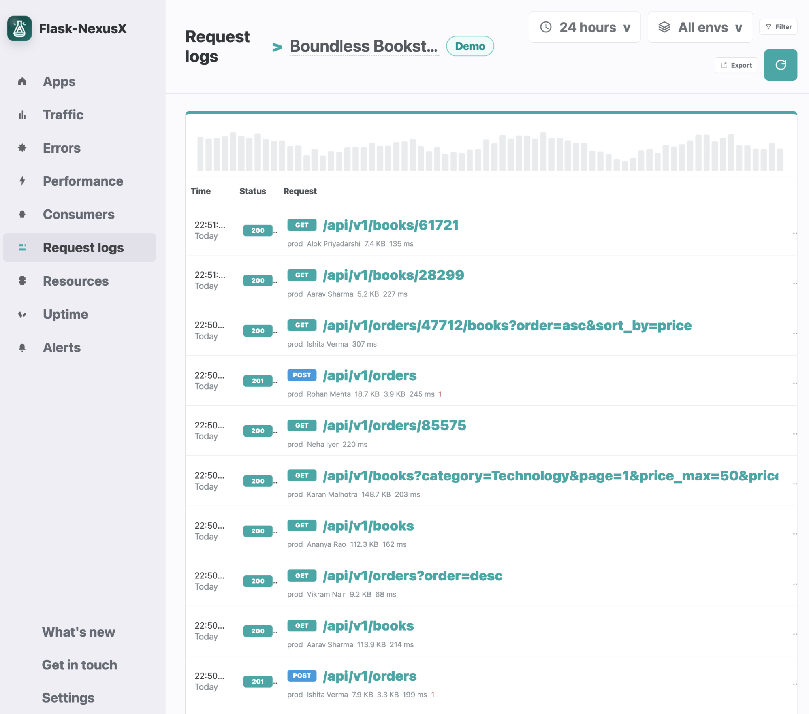

# NexusX

**NexusX** is a lightweight Flask based framework for building REST APIs using class based resources. It provides simple routing, request parsing, response marshalling, custom response representations, error handling, CORS utilities, and example APIs to help developers ship clean REST services faster.

The project also includes a static **API Metrics Dashboard** prototype for visualizing API traffic, errors, latency, consumers, logs, traces, uptime, alerts, CPU usage, and memory usage.

---

## Features

* Class based REST resources using `Resource`
* API routing through `Api.add_resource()`
* HTTP method mapping with `get`, `post`, `put`, `delete`, and other resource methods
* Request argument parsing and validation using `reqparse`
* Response serialization using `marshal`, `marshal_with`, and `fields`
* Built-in JSON representation support
* Custom media-type representation support, such as XML
* Structured API error handling with `abort()`
* CORS helper utilities
* Input validators for URL, regex, date, datetime, boolean, integer range, positive numbers, and natural numbers
* Flask Blueprint integration support
* Example Todo APIs
* Static API metrics dashboard UI
* Unit tests for API behavior, request parsing, fields, CORS, and inputs
* Dockerfile for containerized execution

---

## Preview













---

## Tech Stack

| Category               | Technology                    |
| ---------------------- | ----------------------------- |
| Programming Language   | Python                        |
| Web Framework          | Flask                         |
| REST API Layer         | NexusX API, Resource Classes  |
| Request Handling       | ReqParse                      |
| Response Serialization | Fields, Marshal, Marshal With |
| Response Format        | JSON, Custom Representations  |
| Validation             | Inputs Validators             |
| CORS Support           | Flask-NexusX CORS Utilities   |
| Dashboard Frontend     | HTML, CSS, JavaScript         |
| Testing                | UnitTest, Mock, Tox           |
| Containerization       | Docker                        |
| Package Management     | setup.py, pip                 |
| License                | Apache License 2.0            |

---

## Project Structure

```text
NexusX/
├── api-metrics-dashboard/
│   ├── app.js
│   ├── index.html
│   └── styles.css
├── examples/
│   ├── todo.py
│   ├── todo_simple.py
│   └── xml_representation.py
├── flask_nexusx/
│   ├── representations/
│   │   ├── __init__.py
│   │   └── json.py
│   ├── utils/
│   │   ├── __init__.py
│   │   ├── cors.py
│   │   └── crypto.py
│   ├── __init__.py
│   ├── __version__.py
│   ├── fields.py
│   ├── inputs.py
│   └── reqparse.py
├── images/
│   ├── preview-1.png
│   ├── preview-2.png
│   ├── preview-3.png
│   ├── preview-4.png
│   ├── preview-5.png
│   └── preview-6.png
├── scripts/
│   └── release.py
├── tests/
│   ├── __init__.py
│   ├── compat.py
│   ├── requirements.txt
│   ├── test_accept.py
│   ├── test_api.py
│   ├── test_api_with_blueprint.py
│   ├── test_cors.py
│   ├── test_fields.py
│   ├── test_inputs.py
│   └── test_reqparse.py
├── .coveragerc
├── .gitignore
├── .travis.yml
├── Dockerfile
├── LICENSE.txt
├── Makefile
├── MANIFEST.in
├── README.md
├── setup.cfg
├── setup.py
└── tox.ini
```
---

## Getting Started

### Prerequisites

* Python 3.x
* `pip`
* `virtualenv` or Python `venv`

### Clone the Repository

```bash
git clone https://github.com/alokpriyadarshi618/NexusX.git
cd NexusX
```

### Create a Virtual Environment

```bash
python -m venv .venv
source .venv/bin/activate
```

For Windows:

```bash
python -m venv .venv
.venv\Scripts\activate
```

### Install the Project

```bash
pip install --upgrade pip
pip install -e .
```

### Install Test Dependencies

```bash
pip install -r tests/requirements.txt
```

---

## Quick Start Example

Create a simple REST API using NexusX:

```python
from flask import Flask, request
from flask_nexusx import Api, Resource

app = Flask(__name__)
api = Api(app)

todos = {}

class TodoSimple(Resource):
    def get(self, todo_id):
        return {todo_id: todos[todo_id]}

    def put(self, todo_id):
        todos[todo_id] = request.form["data"]
        return {todo_id: todos[todo_id]}

api.add_resource(TodoSimple, "/<string:todo_id>")

if __name__ == "__main__":
    app.run(debug=True)
```

Run the example included in the repository:

```bash
python examples/todo_simple.py
```

Test it with `curl`:

```bash
curl -X PUT http://localhost:5000/todo1 -d "data=Remember the milk"
curl http://localhost:5000/todo1
```

Expected response:

```json
{
  "todo1": "Remember the milk"
}
```

---

## Request Parsing

NexusX includes a request parser for validating and extracting input data from incoming requests.

```python
from flask import Flask
from flask_nexusx import Api, Resource, reqparse

app = Flask(__name__)
api = Api(app)

parser = reqparse.RequestParser()
parser.add_argument("task", type=str, required=True, help="Task is required")

class TodoList(Resource):
    def post(self):
        args = parser.parse_args()
        return {"task": args["task"]}, 201

api.add_resource(TodoList, "/todos")

if __name__ == "__main__":
    app.run(debug=True)
```

Example request:

```bash
curl -X POST http://localhost:5000/todos -d "task=build an API"
```

---

## Response Marshalling

Marshalling helps control which fields are returned in the API response.

```python
from flask_nexusx import fields, marshal_with

resource_fields = {
    "task": fields.String,
    "priority": fields.Integer,
    "completed": fields.Boolean,
}

class Todo(Resource):
    @marshal_with(resource_fields)
    def get(self):
        return {
            "task": "Build NexusX API",
            "priority": 1,
            "completed": False,
            "internal_note": "This field will not be exposed"
        }
```

Expected response:

```json
{
  "task": "Build NexusX API",
  "priority": 1,
  "completed": false
}
```

---

## Custom Response Representation

NexusX supports custom response representations. For example, you can add XML output support:

```python
from flask import Flask, make_response
from flask_nexusx import Api, Resource
from simplexml import dumps

app = Flask(__name__)
api = Api(app, default_mediatype="application/xml")

def output_xml(data, code, headers=None):
    response = make_response(dumps({"response": data}), code)
    response.headers.extend(headers or {})
    return response

api.representations["application/xml"] = output_xml

class Hello(Resource):
    def get(self, name):
        return {"hello": name}

api.add_resource(Hello, "/<string:name>")

if __name__ == "__main__":
    app.run(debug=True)
```

---

## API Metrics Dashboard

The repository includes a static dashboard prototype inside `api-metrics-dashboard/`.

### Dashboard Sections

* API overview
* Traffic metrics
* Error analytics
* Performance and latency metrics
* Consumer analytics
* Endpoint level metrics
* Request logs
* Application logs
* Distributed traces
* Uptime monitoring
* Alert management
* CPU and memory charts

### Run the Dashboard Locally

```bash
cd api-metrics-dashboard
python -m http.server 8080
```

Open the dashboard in your browser:

```text
http://localhost:8080
```

> Note: The dashboard currently uses static demo data from `app.js`. It can be connected to real API metrics later through backend endpoints or an observability pipeline.

---

## Running with Docker

Build the Docker image:

```bash
docker build -t nexusx .
```

Run the container:

```bash
docker run --rm -p 5050:5050 nexusx
```

The Dockerfile runs the `todo_simple` example on port `5050`.

Test it:

```bash
curl -X PUT http://localhost:5050/todo1 -d "data=Remember the milk"
curl http://localhost:5050/todo1
```

---

## Testing

Run the unit test suite:

```bash
python -m unittest discover -s tests
```

Or use the Makefile:

```bash
make test
```

Run tests across multiple Python and Flask versions using tox:

```bash
tox
```

---

## Development Commands

```bash
# Install the package in editable mode
pip install -e .

# Install test dependencies
pip install -r tests/requirements.txt

# Run tests
python -m unittest discover -s tests

# Build source and wheel distributions
python setup.py sdist bdist_wheel
```
